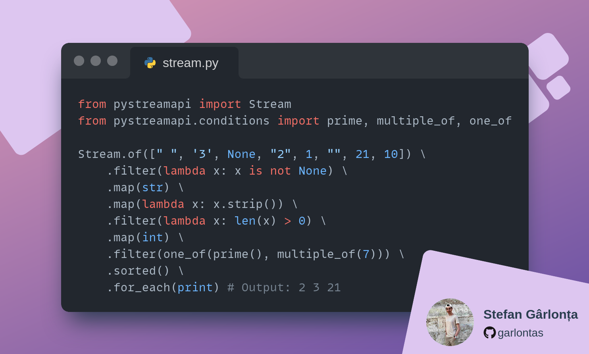
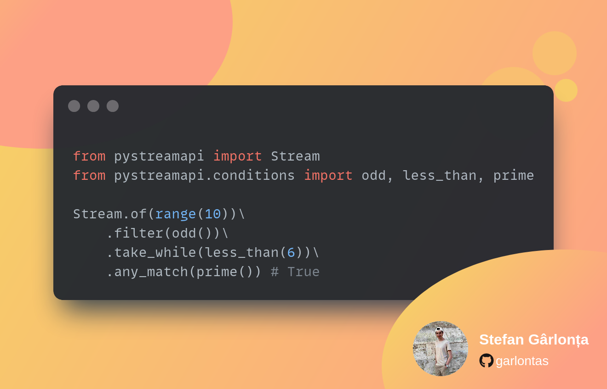

# Welcome to PyStreamAPI!

Welcome to PyStreamAPI! Here you'll find all the documentation you need to get up and running with Streams in Python!

[](https://deepsource.io/gh/PickwickSoft/pystreamapi/?ref=repository-badge) [](https://github.com/PickwickSoft/pystreamapi/actions/workflows/unittests.yml) [](https://github.com/PickwickSoft/pystreamapi/actions/workflows/pylint.yml) [](https://sonarcloud.io/summary/new\_code?id=PickwickSoft\_pystreamapi) [](https://sonarcloud.io/summary/new\_code?id=PickwickSoft\_pystreamapi) [](https://pypi.org/project/streams-py/) [](https://pypi.org/project/streams-py/)

## What is PyStreamAPI?

<figure><figcaption></figcaption></figure>

PyStreamAPI is a Python stream library that draws inspiration from the Java Stream API. Although it closely mirrors the Java API, PyStreamAPI adds some innovative features to make streams in Python even more innovative, declarative and easy to use.

PyStreamAPI offers both sequential and parallel streams and utilizes lazy execution.

Now you might be wondering why another library when there are already a few implementations? Well, here are a few advantages of this particular implementation:

* It provides both sequential and parallel versions.
* Lazy execution is supported, enhancing performance.
* It boasts high speed and efficiency.
* The implementation achieves 100% test coverage.
* It follows Pythonic principles, resulting in clean and readable code.
* It adds some cool innovative features like conditions and an even more declarative look

Let's take a look at a small example:


```python
from pystreamapi import Stream

Stream.of([" ", '3', None, "2", 1, ""]) \
    .filter(lambda x: x is not None) \
    .map(str) \
    .map(lambda x: x.strip()) \
    .filter(lambda x: len(x) > 0) \
    .map(int) \
    .sorted() \
    .for_each(print) # Output: 1 2 3
```


And here's the equivalent code in Java:

```java
Object[] words = { " ", '3', null, "2", 1, "" };
Arrays.stream( words )
      .filter( Objects::nonNull )
      .map( Objects::toString )
      .map( String::trim )
      .filter( s -> ! s.isEmpty() )
      .map( Integer::parseInt )
      .sorted()
      .forEach( System.out::println );  // Output: 1 2 3
```

### What is a Stream?

A `Stream` is a powerful abstraction for processing sequences of data in a functional and declarative manner. It enables efficient and concise data manipulation and transformation.

Similar to its counterparts in Java and Kotlin, a Stream represents a pipeline of operations that can be applied to a collection or any iterable data source. It allows developers to express complex data processing logic using a combination of high-level operations, promoting code reusability and readability.

With Streams, you can perform a wide range of operations on your data, such as filtering elements, transforming values, aggregating results, sorting, and more. These operations can be seamlessly chained together to form a processing pipeline, where each operation processes the data and passes it on to the next operation.

One of the key benefits of Stream is lazy evaluation. This means that the operations are executed only when the result is actually needed, optimizing resource usage and enabling efficient processing of large or infinite datasets.

Furthermore, Stream supports both sequential and parallel execution. This allows you to leverage parallel processing capabilities when dealing with computationally intensive tasks or large amounts of data, significantly improving performance.

`pystreamapi.Stream` represents a stream that facilitates the execution of one or more operations. Stream operations can be categorized as either intermediate or terminal.

Terminal operations return a result of a specific type, while intermediate operations return the stream itself, enabling method chaining for multi-step operations.

Let's examine an example using Stream:

```python
Stream.of([" ", '3', None, "2", 1, ""]) \
    .filter(lambda x: x is not None) \ # Intermediate operation
    .map(str) \ # Intermediate operation
    .map(lambda x: x.strip()) \ # Intermediate operation
    .filter(lambda x: len(x) > 0) \ # Intermediate operation
    .map(int) \ # Intermediate operation
    .sorted() \ # Intermediate operation
    .for_each(print) # Terminal Operation (Output: 1 2 3)
```

Operations can be performed on a stream either in parallel or sequentially. A parallel stream executes operations concurrently, while a sequential stream processes operations in order.

Considering the above characteristics, a stream can be defined as follows:

* It is not a data structure itself but operates on existing data structures.
* It does not provide indexed access like traditional collections.
* It is designed to work seamlessly with lambda functions, enabling concise and expressive code.
* It facilitates easy aggregation of results into lists, tuples, or sets.
* It can be parallelized, allowing for concurrent execution of operations to improve performance.
* It employs lazy evaluation, executing operations only when necessary.

## Use conditions to speed up your workflow! <a href="#use-conditions-to-speed-up-your-workflow" id="use-conditions-to-speed-up-your-workflow"></a>

<figure><figcaption><p>Conditions Sample</p></figcaption></figure>

Conditions provide a convenient means for performing logical operations within your Stream, such as using `filter()`, `take_while()`, `drop_while()`, and more. With PyStreamAPI, you have access to a staggering 111 diverse conditions that enable you to process various data types including strings, types, numbers, and dates. Additionally, PyStreamAPI offers a powerful combiner that allows you to effortlessly combine multiple conditions, facilitating the implementation of highly intricate pipelines.

Explore the wide range of possibilities available to you by utilizing conditions here:


[conditions](reference/conditions/)


## Error handling: Work with data that you don't know

PyStreamAPI offers a powerful error handling mechanism that allows you to handle errors in a declarative manner. This is especially useful when working with data that you don't know.


[error-handling.md](reference/api-reference/error-handling.md)


## Data loaders: Load data from CSV and JSON files

Data loaders provide a convenient way to process data from CSV, JSON, XML and YAML files in your streams. You can access the values of each data set as if it were an object, containing the header/key names as attributes.


[data-loaders.md](reference/data-loaders.md)


## Want to jump right in?

Feeling like an eager beaver? Jump in to the quick start docs and get making your first Stream:


[quick-start.md](quick-start.md)


## Want to deep dive?

Dive a little deeper and start exploring our comprehensive documentation to get an idea of everything that's possible with PyStreamAPI:


[api-reference](reference/api-reference/)

