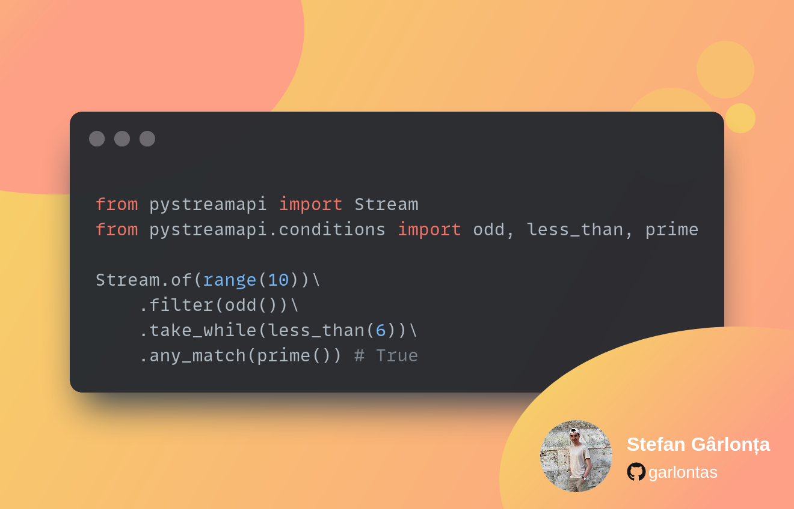

# Conditions

<figure><figcaption></figcaption></figure>

PyStreamAPI presents four distinct groups of conditions for your convenience. Within these groups, you'll find a variety of conditions with varying parameters. For instance, certain conditions like `even()` do not require any parameters, while others such as `less_than(n)` involve specifying a single parameter.&#x20;

Moreover, PyStreamAPI provides a single combiner that empowers you to seamlessly merge multiple conditions, thereby enhancing your ability to manipulate data more effectively.

### Import

All conditions can be imported from:

```python
from pystreamapi.conditions import …
```

In order to import all conditions from a specific group, use these imports:

```python
from pystreamapi.conditions.numeric import *
from pystreamapi.conditions.types import *
from pystreamapi.conditions.string import *
from pystreamapi.conditions.date import *
```

### Type conditions


[type-conditions.md](type-conditions.md)


### Numeric conditions


[numeric-conditions.md](numeric-conditions.md)


### String conditions


[string-conditions.md](string-conditions.md)


### Date conditions


[date-conditions.md](date-conditions.md)


### Combiner

`one_of(*conditions)` checks if one of the given conditions are fulfilled. You can pass as many conditions as you want.

```python
from pystreamapi import Stream
from pystreamapi.conditions import prime, even, one_of

Stream.of([1, 2, 3, 4, 5]) \
    .filter(one_of(even(), prime())) \
    .for_each(print)
```
